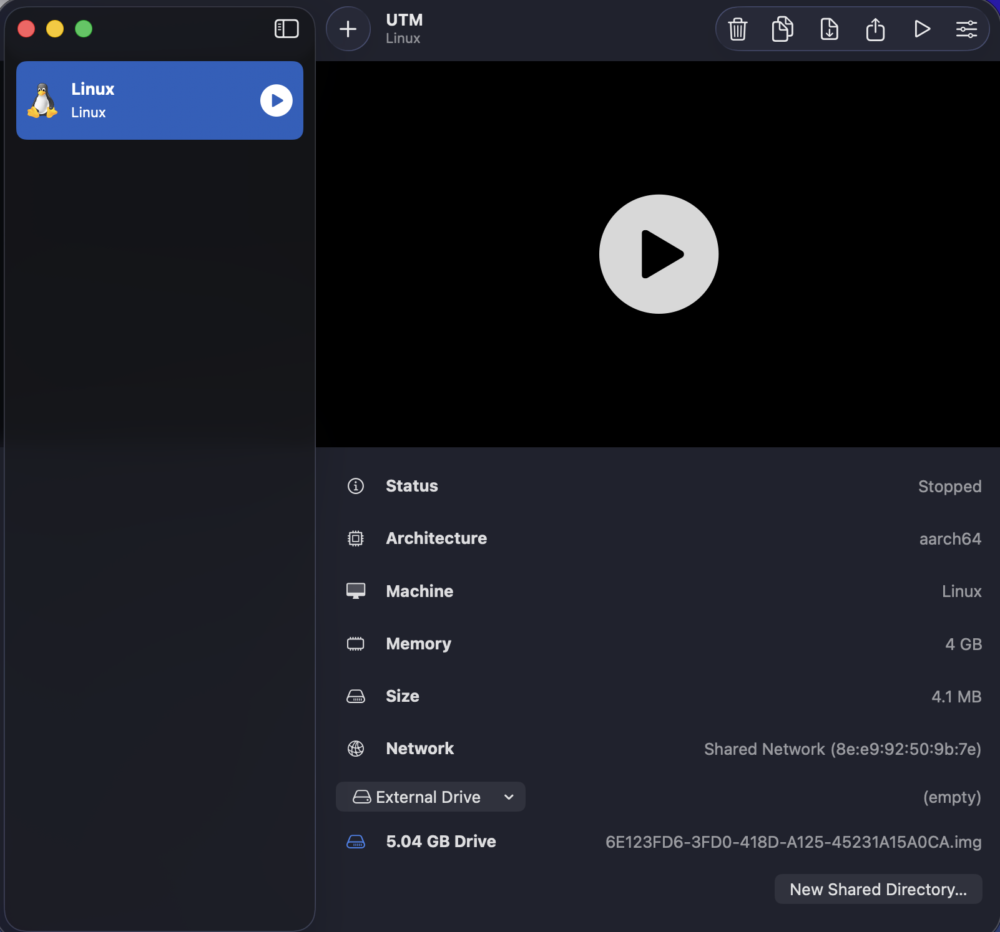
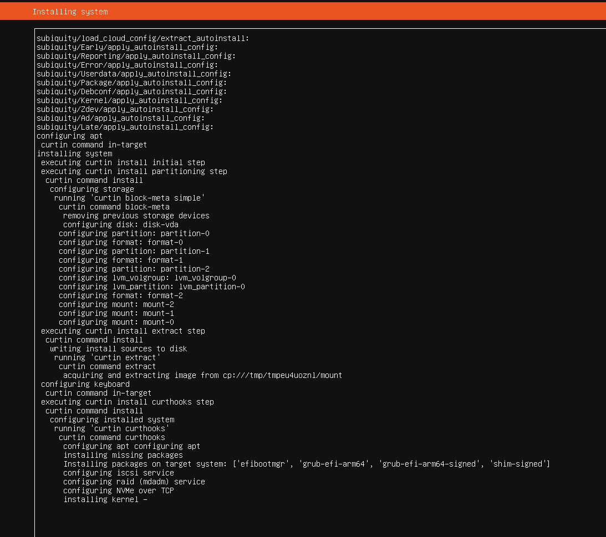
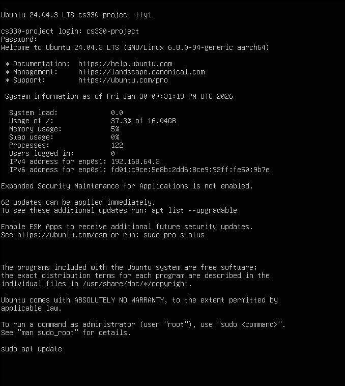
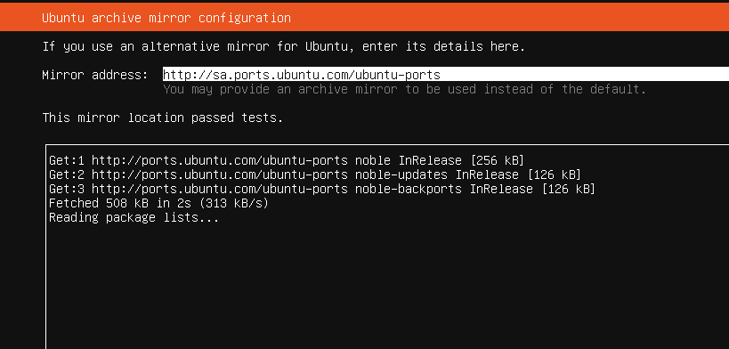

# Phase I Report
**Parallel Performance Evaluation (Process-based Matrix Multiplication)**

This page includes the full standalone HTML report inside the Phase I section
of the website.

Use the button below if you want to open the report as a separate full page.

<a href="../report-full.html" class="md-button md-button--primary">Open Full HTML Report</a>
<a href="../report.pdf" class="md-button">Open PDF Version</a>

---

## Embedded Report

<iframe
  src="../report-full.html"
  style="width: 100%; height: 1100px; border: 1px solid rgba(0,0,0,.08); border-radius: 16px;"
  loading="lazy"
  title="Phase I HTML Report">
</iframe>

## 6) Discussion

In theory, parallel processes can reduce execution time by dividing computation
across cores. However, Phase I results show that for the tested sizes (1200–
2400), using 4 processes provided **minimal or negative** performance impact.

### Why performance did not improve

* ## :material-source-fork: **Process Creation Overhead**

  Creating multiple processes with `fork()` introduces overhead that can dominate short executions.

* ## :material-sync: **Synchronization Cost**

  The parent must wait for all children (`wait()`), so total time includes coordination overhead.

* ## :material-ruler: **Problem Size Threshold**

  For these matrix sizes, the computation may not be large enough to outweigh overhead.

For significantly larger matrices (e.g., N=10000), performance gains may become
more likely because computation time would dominate process overhead.

---

### 6.1 Implications for Parallel Programming

* Parallelism improves performance only when workload exceeds overhead cost
* Using all available cores does not guarantee better performance
* There is a minimum problem size where parallelization becomes beneficial

---

### 6.2 Experimental Limitations

* **Virtualization overhead:** VM layer may add performance penalties
* **ARM64 architecture:** Different characteristics than x86 systems
* **Initialization overhead:** Random initialization adds non-parallelizable work

---

## 7) Conclusion

In Phase I, we successfully:

* Set up Ubuntu Linux (**24.04.3 LTS ARM64**) in a virtual machine
* Installed GCC and development tools
* Compiled and executed the provided program
* Tested **6** configurations
* Collected execution-time data across all runs

### Key findings

* Parallel processes did **not** provide meaningful speedup for these sizes
* Process creation and synchronization overhead likely dominated runtime
* Larger problem sizes may be required to observe clear benefits

??? note "Working VM"
    

??? note "Installing Kernel"
    

??? note "Log in and update"
    

??? note "Passing Memory Tests"
    

---

## Future Work Recommendations

* ## :material-source-fork: **Thread-Based Parallelism**

  Evaluate pthread-based implementations and compare overhead.

* ## :material-sitemap-outline: **Improved Work Distribution**

  Explore alternative decomposition strategies for better load balance.

* ## :material-timer-sand: **Overhead Reduction**

  Investigate techniques such as process pooling or reduced synchronization.

* ## :material-ruler: **Larger Problem Sizes**

  Test matrices larger than 2400×2400 to identify the crossover point.

* ## :material-compare: **Comparative Benchmarks**

  Compare against sequential and optimized baselines to quantify overhead costs.

---

## Downloadable Version

<a href="../report.pdf" class="md-button">Open the PDF report</a>
