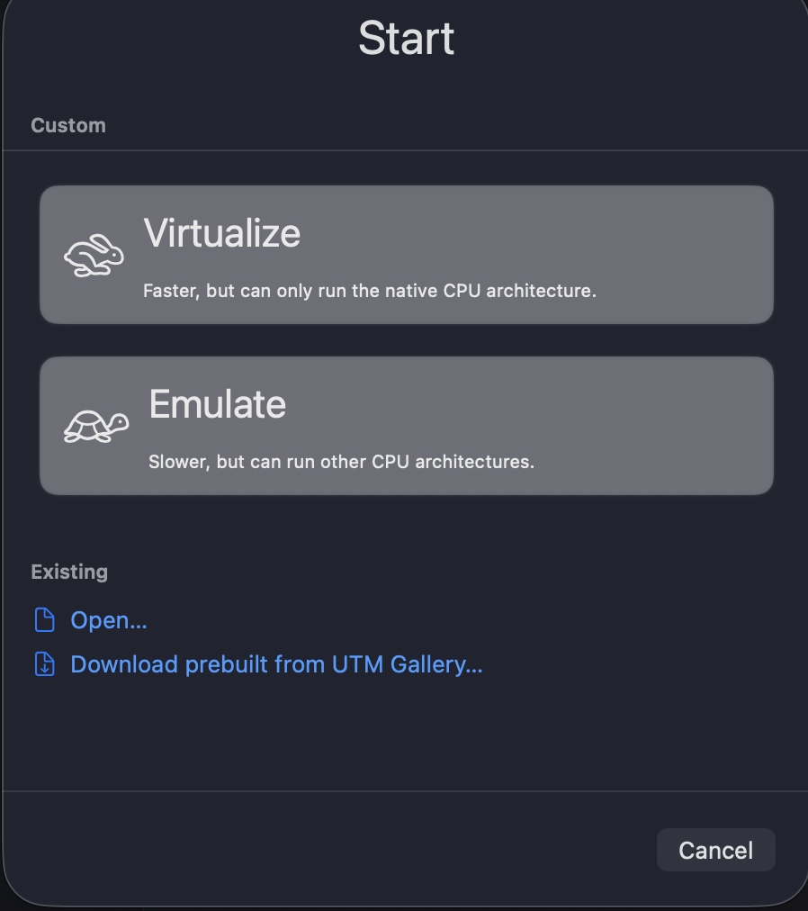
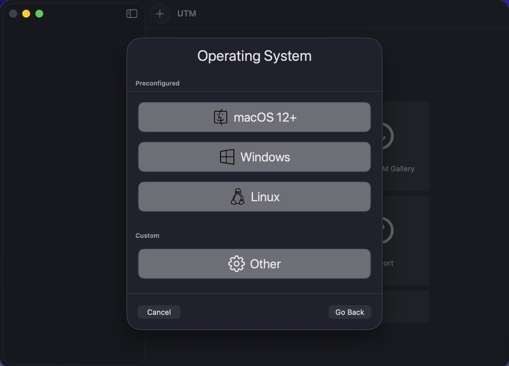
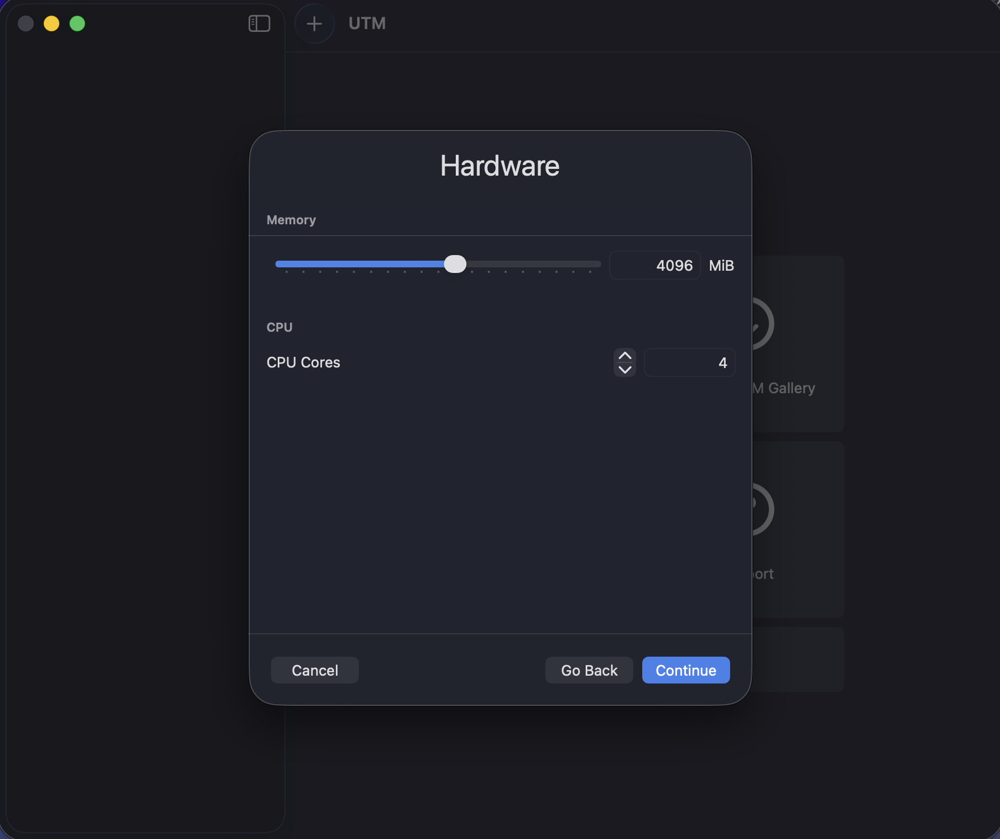
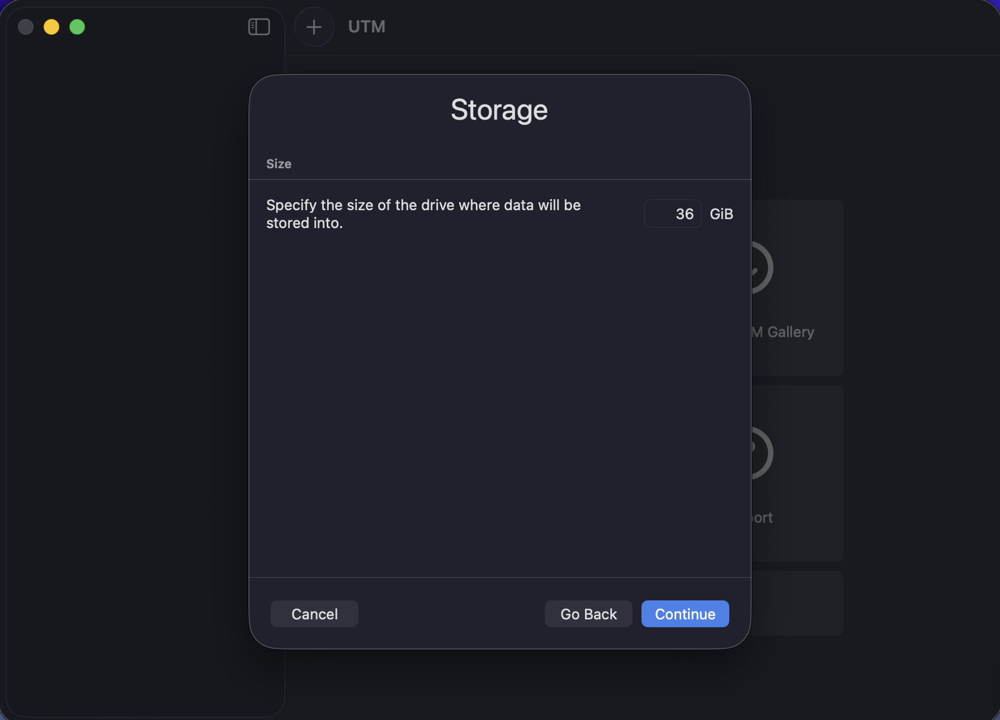
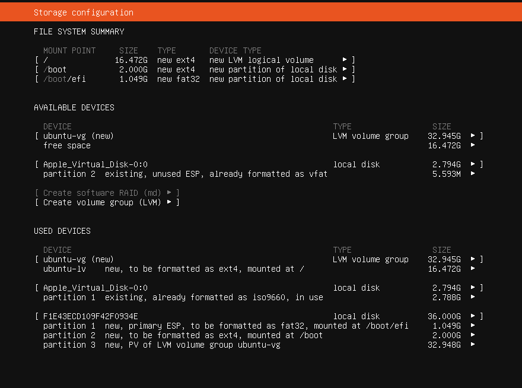
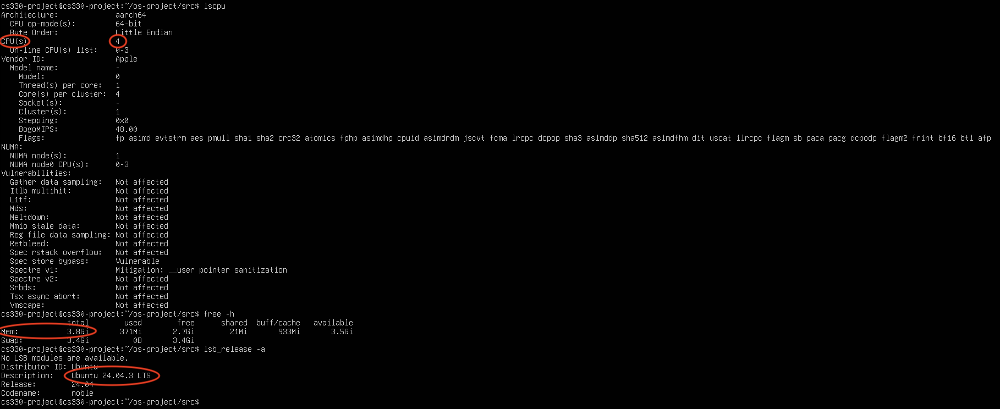
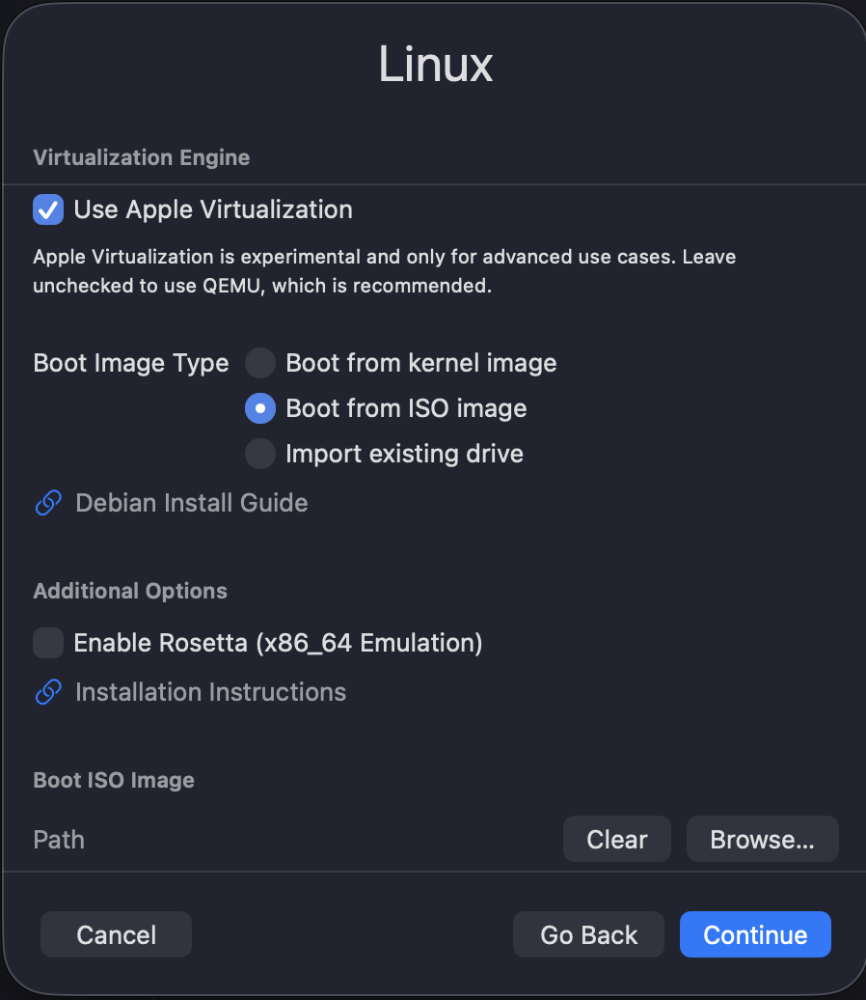
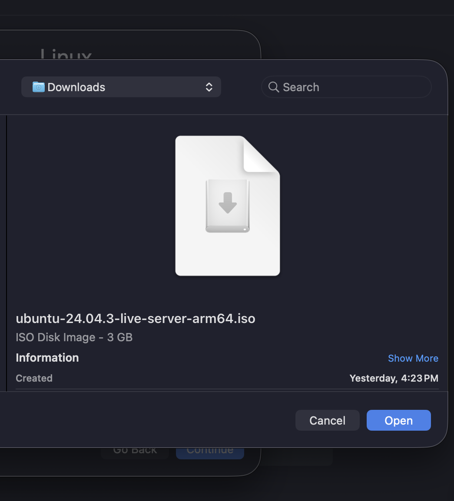

<div class="home-hero" markdown>
<div class="home-hero__text" markdown>

# Setup  
**Virtual Machine & Linux Environment Configuration**

This section documents the system environment used for all
experiments in Phase I, ensuring reproducibility and controlled execution.

</div>
</div>

---

## System Environment

All experiments were conducted inside a Linux virtual machine
to maintain consistency and eliminate host-system variability.

The VM was created using **UTM on macOS**, configured with
Apple’s native virtualization framework.

---

### Virtual Machine Creation

??? note "Creating a VM with UTM"
    

??? note "Virtualize"
    

---

### Operating System

- **Ubuntu 24.04.3 LTS**
- Architecture: **ARM64 (aarch64)**

??? note "Linux"
    

---

### Resource Allocation

The VM was configured with:

- **4 GB RAM**
- **4 CPU cores**
- Adequate storage capacity for OS, source code, and output files

??? note "Memory and Cores"
    

??? note "Storage"
    

??? note "Storage Configuration"
    

---

### System Verification

System verification commands were executed to confirm environment consistency:

```bash
uname -a
free -h
lsb_release -a
```

These confirmed:

* CPU architecture: **aarch64**
* Memory allocation
* Core count
* Ubuntu version

??? note "System Specifications"
    

---

## Software Tools

The following tools were installed inside Ubuntu:

<div class="grid cards" markdown>

* ## :material-tools: **GCC Compiler**
  Version 11.4.0 used for compilation.

* ## :material-package-variant: **build-essential**
  Installed standard development utilities.

* ## :material-console: **Linux Terminal**
  Used for compilation, execution, and system monitoring.

</div>

---

### Installation Command

```bash
sudo apt install build-essential
```

### Compilation Command

```bash
gcc -Wall matrix_fork.c -o matrix_fork
```

The `-Wall` flag enables compiler warnings to promote safer and cleaner code.

??? note "Apple Virtualization"
    

??? note "Ubuntu"
    

---

This setup ensures that all experiments were conducted in a
controlled, reproducible Linux environment suitable for evaluating
process-based parallel performance.
