

# Phase 2 Results

This page records the official benchmark outcomes for the Java multithreading
experiment and explains what the measurements mean.

---

## Main Results Table

| Threads | Avg Execution Time (ms) | Speedup | % Improvement |
|---|---:|---:|---:|
| 1 | 3.754 | 1.00 | 0.00 |
| 2 | 4.335 | 0.87 | -15.48 |
| 4 | 3.111 | 1.21 | 17.14 |
| 6 | 0.698 | 5.38 | 81.41 |
| 8 | 0.649 | 5.79 | 82.72 |

---

## What The Table Shows

* ## :material-timer-outline: **Best Runtime**

  `8` threads produced the fastest average execution time: **0.649 ms**.

* ## :material-chart-line: **Scaling Pattern**

  The improvement was not gradual. The major drop happened between `4` and `6`
  threads.

* ## :material-alert-outline: **Overhead At Low Counts**

  `2` threads were slower than `1`, which means thread-management cost was
  larger than the benefit at that configuration.

* ## :material-check-decagram: **Practical Sweet Spot**

  `6` and `8` threads both performed very well, so the useful scaling region
  begins around those higher thread counts.

---

## Graphs

### Average Execution Time vs Number of Threads

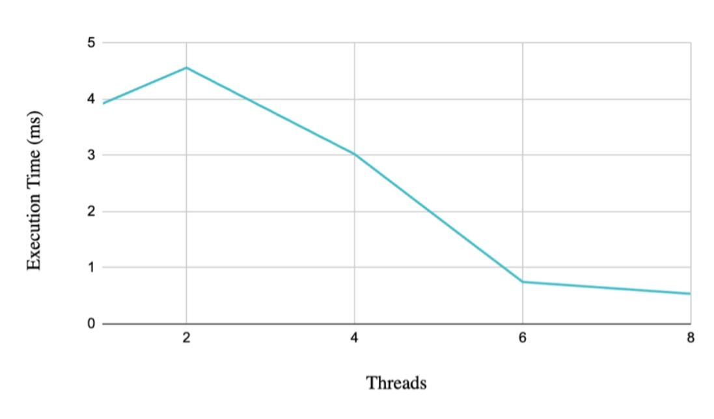

This graph shows the direct runtime trend. The main takeaway is that runtime
did not decrease smoothly from `1` to `8` threads. Instead, the program became
slower at `2` threads, improved slightly at `4`, and only then showed strong
benefits at `6` and `8`.

### Speedup vs Number of Threads

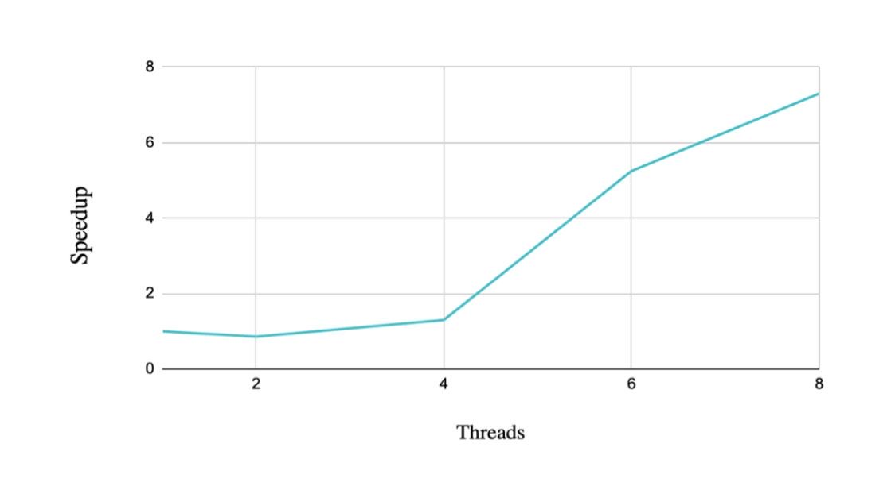

This graph compares each configuration against the single-thread baseline. A
speedup below `1.0` means the parallel version is worse than the baseline,
which is exactly what happened with `2` threads. The strongest gains appear at
`6` and `8` threads, where the measured speedup exceeded `5x`.

### Percentage Improvement vs Number of Threads

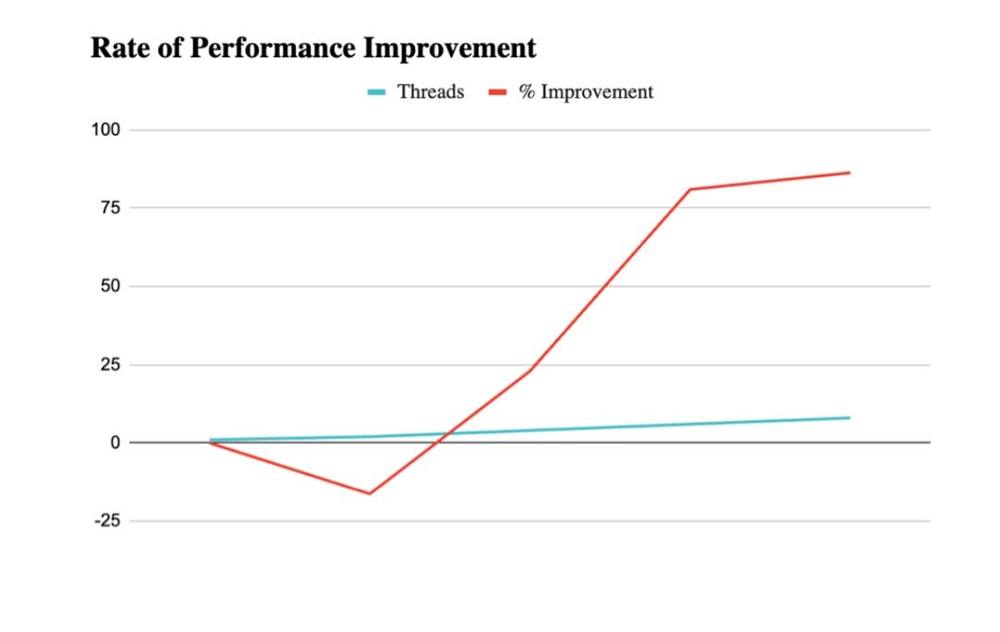

This graph expresses the same pattern as a percentage. It highlights that the
performance benefit was not minor once the program reached higher thread counts:
the improvement exceeded **80%** for both `6` and `8` threads.

---

## Raw Trial Table

| Threads | Run 1 | Run 2 | Run 3 | Run 4 | Run 5 | Run 6 | Run 7 | Run 8 | Run 9 | Run 10 | Run 11 | Run 12 | Average (ms) |
|---|---:|---:|---:|---:|---:|---:|---:|---:|---:|---:|---:|---:|---:|
| 1 | 3.921 | 3.671 | 3.813 | 3.690 | 3.759 | 3.702 | 3.704 | 3.740 | 3.724 | 3.924 | 3.725 | 3.680 | 3.754 |
| 2 | 4.560 | 4.207 | 4.273 | 4.252 | 4.244 | 4.217 | 4.362 | 4.771 | 4.240 | 4.205 | 4.347 | 4.348 | 4.335 |
| 4 | 3.022 | 3.077 | 3.171 | 3.116 | 3.139 | 3.113 | 3.071 | 2.823 | 3.446 | 3.139 | 3.119 | 3.094 | 3.111 |
| 6 | 0.747 | 0.634 | 0.685 | 0.678 | 0.592 | 0.708 | 0.848 | 0.616 | 0.631 | 0.758 | 0.772 | 0.707 | 0.698 |
| 8 | 0.537 | 0.788 | 0.588 | 0.773 | 0.611 | 1.013 | 0.567 | 0.571 | 0.650 | 0.639 | 0.515 | 0.533 | 0.649 |

---

## Interpreting The Raw Runs

* The `1`-thread baseline is stable and stays around **3.7 ms**
* The `2`-thread runs are consistently worse, not just worse by accident in one trial
* The `4`-thread runs cluster close together, which suggests a small but consistent gain
* The `6`-thread runs are very fast with moderate variation
* The `8`-thread runs are usually the fastest, but one run crossed **1.0 ms**, showing some scheduling noise

This is why averages matter: a single fast run or a single slow run does not
fully describe the configuration. The average provides a fairer comparison.

---

## Run Evidence

??? note "Excel Summary Screenshot"
    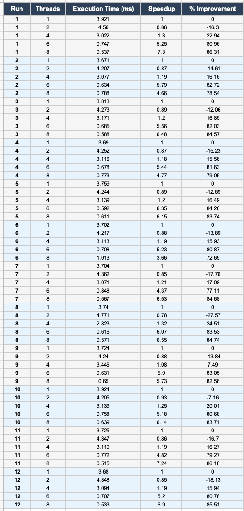

??? note "Run 1"
    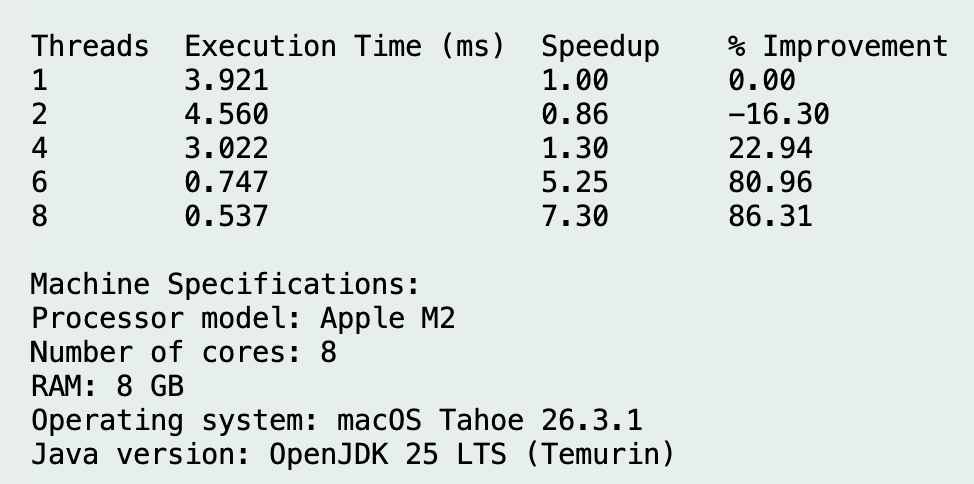

??? note "Run 2"
    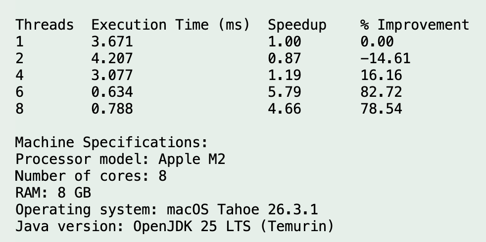

??? note "Run 3"
    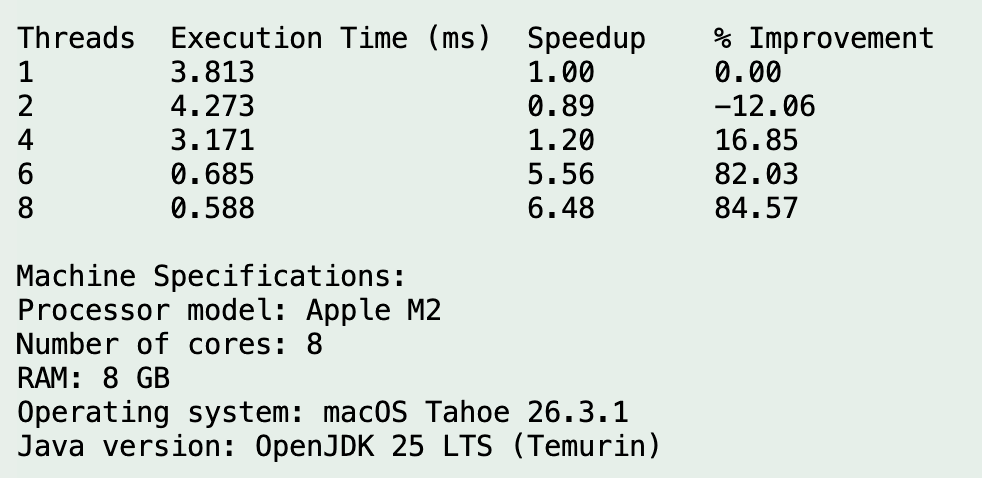

??? note "Run 4"
    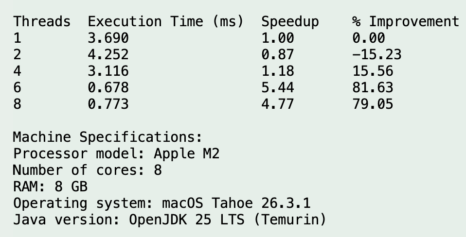

??? note "Run 5"
    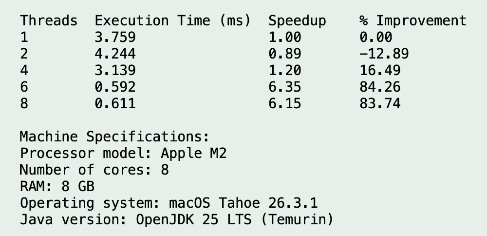

??? note "Run 6"
    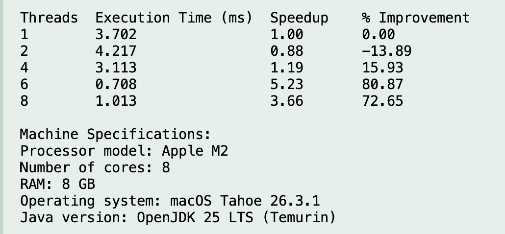

??? note "Run 7"
    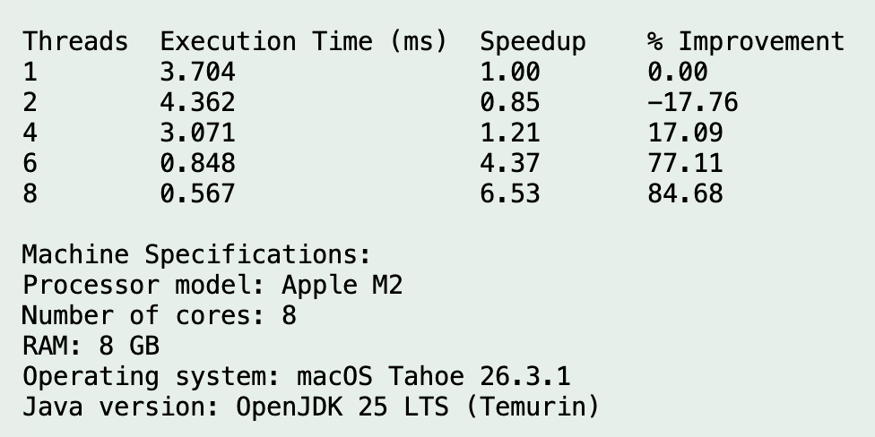

??? note "Run 8"
    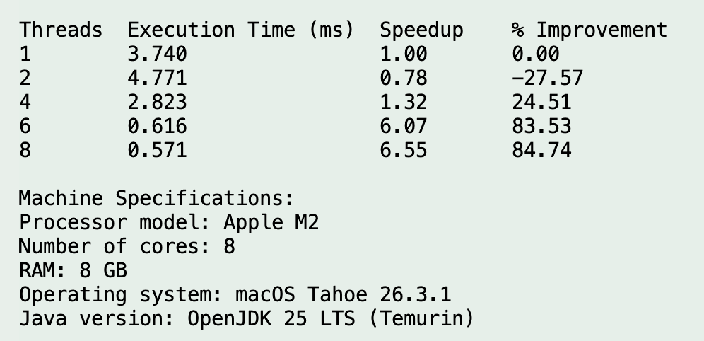

??? note "Run 9"
    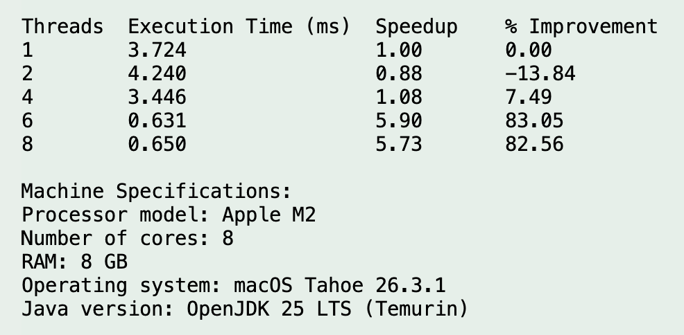

??? note "Run 10"
    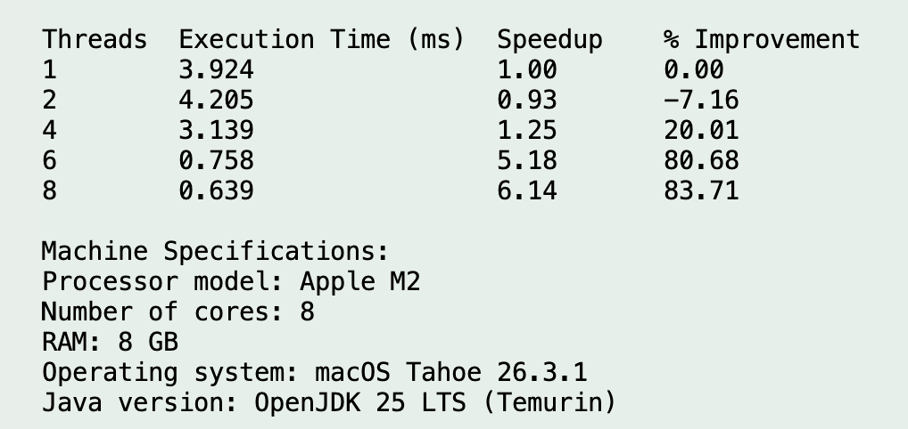

??? note "Run 11"
    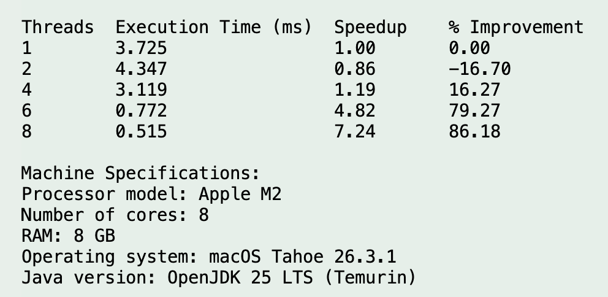

??? note "Run 12"
    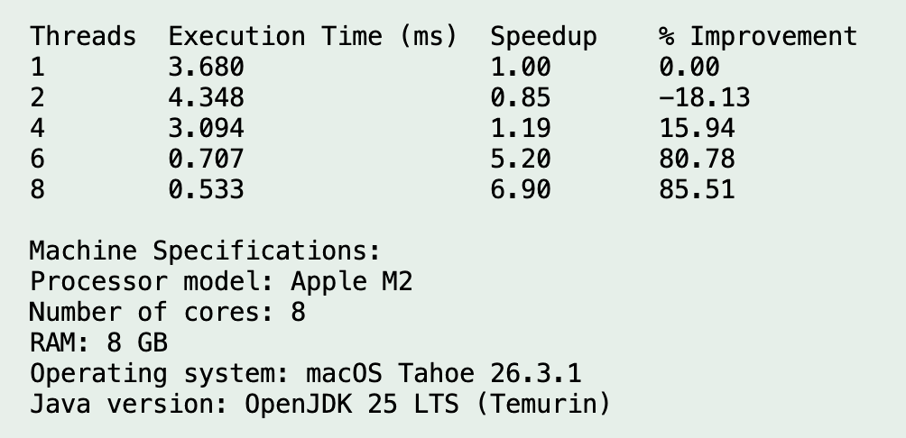

---

## Machine Specifications

| Item | Value |
|---|---|
| Processor Model | Apple M2 |
| Physical Cores | 8 (4 performance + 4 efficiency) |
| Logical Cores (Threads) | 8 |
| RAM | 8 GB |
| Operating System | macOS Tahoe 26.3.1 |
| Java Version | OpenJDK 25 LTS (Temurin) |

---

## Final Result Statement

The benchmark shows that multithreading was beneficial for this workload, but
only after the thread count was high enough to outweigh overhead. The data
supports **8 threads** as the best measured configuration, while **6 threads**
also delivered excellent performance.
