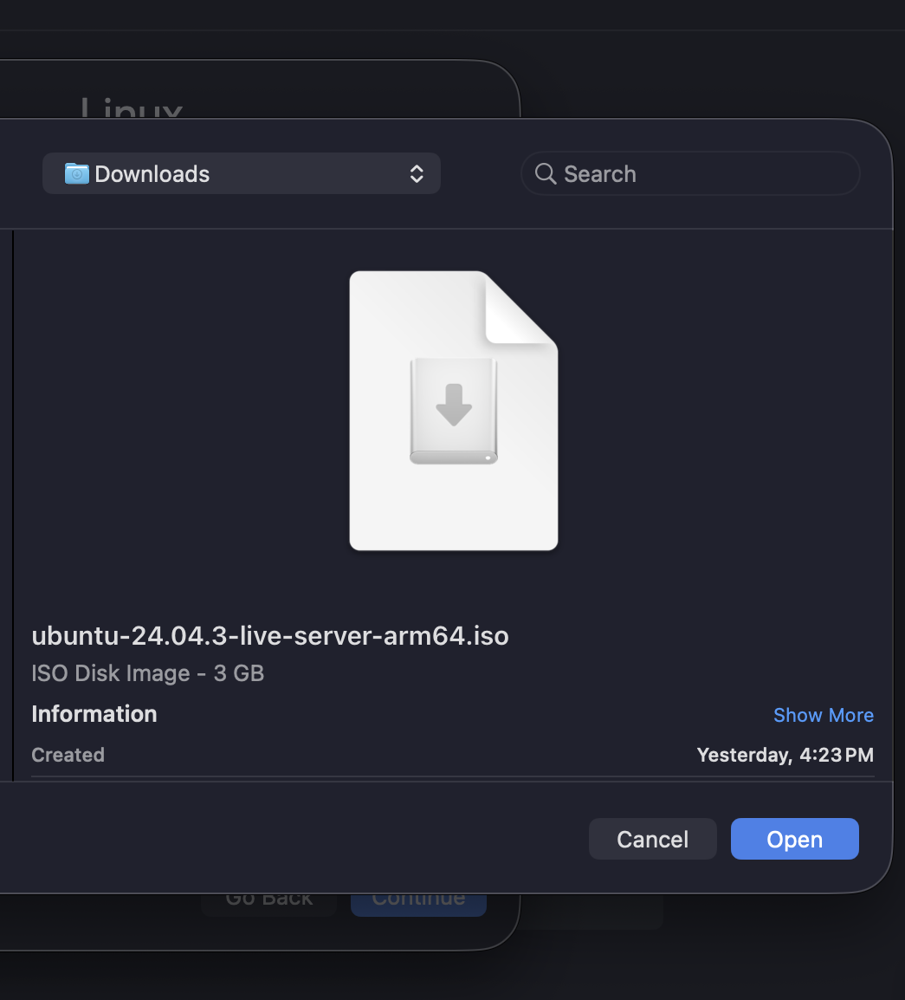

# Setup

## System Environment
All experiments were conducted inside a Linux virtual machine to ensure a consistent and reproducible execution environment. The virtual machine was created using UTM on macOS and configured to use Apple's virtualization framework.
??? note "Creating a VM with UTM"
    

??? note "Virtualize"
    

The guest operating system used was Ubuntu 24.04.3 LTS (ARM64). 

??? note "Linux"
    

The virtual machine was allocated 4 GB of memory and 4 CPU cores, which provided sufficient resources for parallel execution. 

??? note "Memory and Cores"
    

Storage capacity was configured to ensure sufficient disk space for the operating system, source code, and experimental outputs.
??? note "Storage"
    

??? note "Storage Configuration"
    

System verification commands (e.g., `uname -a`, `free -h`, `lsb_release -a`) were used to confirm the CPU architecture (aarch64), available memory, core count, and OS version, ensuring a stable and controlled environment.

??? note "System Specifications"
    

## Software Tools
The following tools were installed inside the Linux environment:

- **GCC compiler** (version 11.4.0)
- **Standard Linux development utilities** (`build-essential`)
- **Linux terminal environment**

??? note "Apple Virtualization"
    

??? note "Ubuntu"
    

The GCC compiler and development utilities were installed via `sudo apt install build-essential`. The program was compiled with the `-Wall` flag to enable all warnings, ensuring code quality. These tools together enabled the compilation and execution of the provided C program.